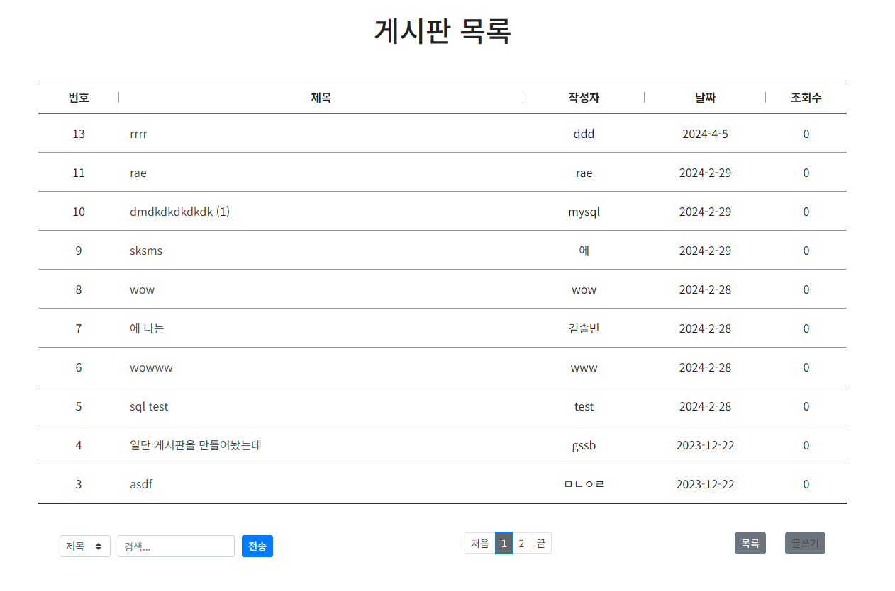

# Same Board, Other Ways.

링크
---
[Node.js / Express](http://3.34.240.139:3000/)
[Node.js / Express Github](https://github.com/romero9919/board_express)

[Springboot](http://3.34.240.139:8080/)
[Springboot Github](https://github.com/romero9919/board_spboot)

[Spring](http://3.34.240.139/spbbs/list?page=1)
[Spring Github](https://github.com/romero9919/spbbs)

[php Github](https://github.com/romero9919/board_php)

개요
---

동일한 DB로 이루어진 간단한 CRUD 게시판을 여러 방식으로 구현해 본 프로젝트입니다.

프로젝트 설정
---

디자인 / jQuery, Bootstrap, Summernote 사용

DB / MySQL, AWS RDB 사용

백엔드
1. Node.js & Express
2. SpringBoot
3. Spring Legacy
4. php
   
