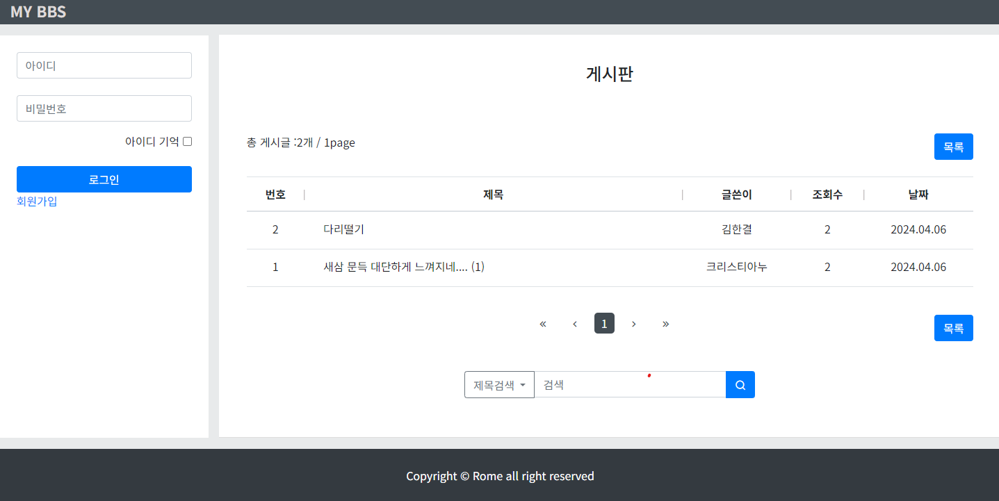

# jsp Board Project

링크
---

[jsp Board](http://3.34.240.139:80/)
[Github](https://github.com/romero9919/jspBoard)

개요
---

jsp, Java Servlet으로 회원가입, 게시글 작성 및 검색 등 기본적 기능을 갖춘 게시판 프로젝트입니다.

프로젝트 설정
---

디자인 / jQuery, Bootstrap 사용

DB / MySQL, AWS RDB 사용

JDK 11, Tomcat 9, Commons io 사용

